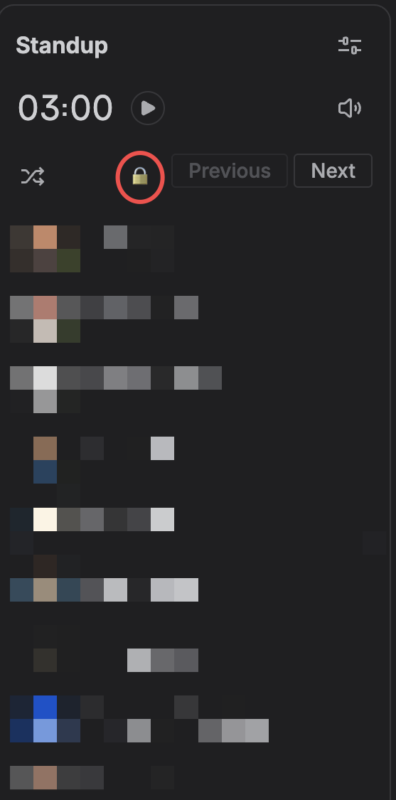

# Jira Standup Order Locker

Chrome Manifest V3 extension for Jira Cloud standups.

## Features

- Adds one lock/unlock icon next to Jira Standup's native Previous button.
- Keeps the participant order stable while locked.
- Accepts Jira's native Shuffle button as an intentional new order.
- Persists participated check marks across refreshes during the same standup session.
- Clears the extension cache when Jira's native End standup button is clicked.
- Optionally shows every board assignee filter in one horizontally scrollable row below the board controls (enabled by default).
- Optional setting to click Jira board Clear filters after opening a board with active filters.

## Install from Release

1. Download the latest zip from [Releases](https://github.com/hkilimci/jira-standup-locker/releases).
2. Unzip it to a folder.
3. Open `chrome://extensions`.
4. Enable Developer mode.
5. Click Load unpacked.
6. Select the unzipped folder.

## Install Locally

1. Open `chrome://extensions`.
2. Enable Developer mode.
3. Click Load unpacked.
4. Select this repository folder.

## Options

Open the extension options to enable or disable the expanded board assignee row and automatic board filter clearing. The expanded assignee row is enabled by default; automatic filter clearing is disabled by default. These settings are independent from the standup lock state.

## Files

- `manifest.json` - Chrome extension manifest.
- `board-assignee-row.js` - expands Jira's compact board assignee filter into a full row.
- `content.js` - Jira content script.
- `options.html` / `options.js` - extension options UI.
